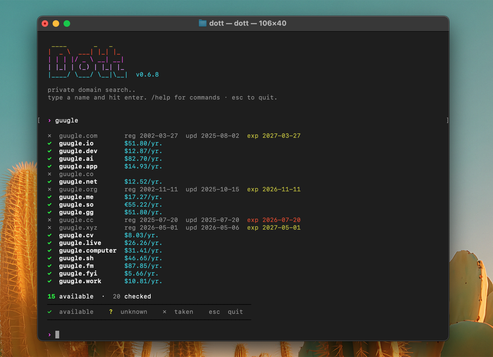

<p align="center">
  
</p>

Domain search for the terminal. Checks RDAP, WHOIS, and DNS in parallel — **directly from your machine**. No proxy API, no analytics, nothing phoning home.

## Install

**Homebrew (macOS / Linux):**
```sh
brew tap yodatoshicom/dott https://github.com/yodatoshicom/dott
brew install dott
```

**curl (macOS / Linux):**
```sh
curl -fsSL https://raw.githubusercontent.com/yodatoshicom/dott/master/install.sh | sh
```

**Windows:**
```sh
git clone https://github.com/yodatoshicom/dott && cd dott && cargo install --path .
```

## Usage

```sh
dott                        # interactive mode
dott myname                 # check across all TLDs
dott myname -t com,io,dev   # specific TLDs
dott -s cool project        # suggest names from keywords
dott myname --plain         # machine-readable output
echo myname | dott          # pipe mode
```

Sample output:

```text
  ✓  myname.com              $11.08/yr.
  ✓  myname.dev              $12.87/yr.
  ?  myname.gg
  ✗  myname.io     reg 2019-05-02  exp 2026-08-15
  ✗  myname.ai     reg 2021-11-30  exp 2027-03-01

  2 available  ·  14 checked
```

> `✓` available  ·  `✗` taken  ·  `?` unknown

Inside interactive mode:

| Input               | What it does                         |
|---------------------|--------------------------------------|
| `name`              | check across all TLDs                |
| `name+`             | suggest prefix/suffix variants       |
| `+`                 | reuse the last searched name         |
| `/watch <domain>`   | notify when a domain becomes free    |
| `/unwatch <domain>` | stop watching                        |
| `/list`             | show watchlist                       |
| `/help`             | command reference                    |

## Watchlist

```sh
dott --watch myname.com      # notify me when it becomes available
dott --watching              # show what you're tracking
dott --unwatch myname.com
```

On macOS, dott installs a LaunchAgent that re-checks the list daily at 9am and sends a system notification when a status changes.

## How it works

Three checks run in parallel for each domain:

| Source | Method             | What it tells you                   |
|--------|--------------------|-------------------------------------|
| RDAP   | HTTPS to registry  | Status + registration/expiry dates  |
| WHOIS  | TCP port 43        | Status + registration/expiry dates  |
| DNS    | Cloudflare DoH     | Whether NS records exist            |

Results are merged (DNS > RDAP > WHOIS priority). Expiring domains are highlighted — orange under 90 days, yellow under a year.

## Supported TLDs

com, net, org, io, dev, app, co, ai, me, so, gg, cc, cv, xyz, live, computer, sh, fm, fyi, work

## License

[MIT](LICENSE)
